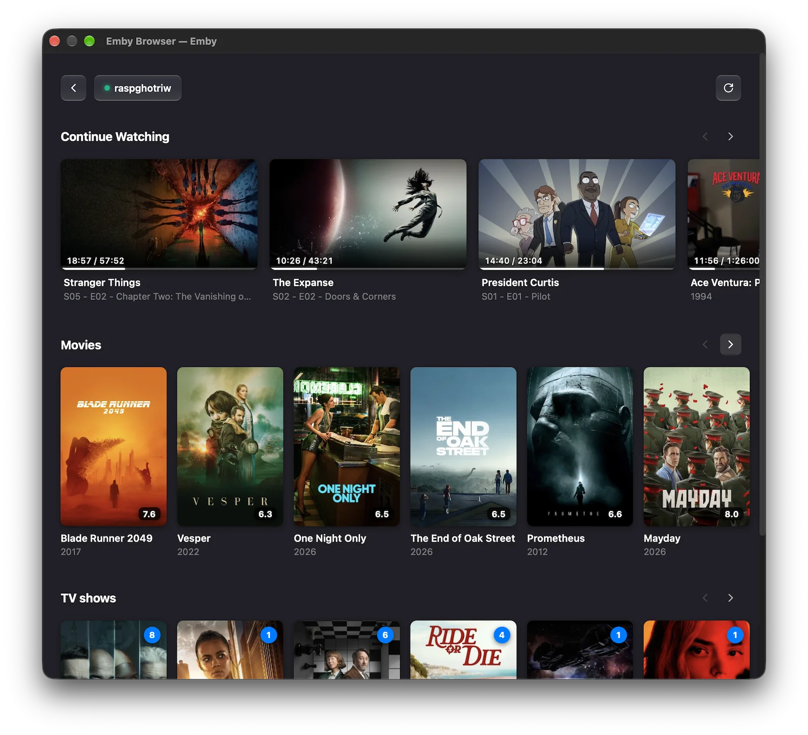

# iina-emby

Emby plugin for [IINA](https://iina.io). Provides a media browser interface and playback integration with Emby servers.



## Features

- Standalone media browser (Continue Watching, Libraries, TV Shows, Movies)
- Direct playback in IINA player windows
- Progress reporting and playback resume sync with Emby server
- Next episode autoplay
- Subtitle downloading from Emby
- Multi-server support

## Installation

### From IINA (Recommended)

1. Open **IINA Preferences** (`⌘,`) -> **Plugins**.
2. Click **Install from GitHub / URL**.
3. Enter `ghotriw/iina-emby` and click **Install**.

### Manual

Download the `.iinaplgz` package from [Releases](https://github.com/ghotriw/iina-emby/releases) and open it with IINA.

## Development

```bash
pnpm install
pnpm run build

# Watch plugin scripts
pnpm run dev:plugin

# Run UI in browser
pnpm run dev

# Type check
pnpm run typecheck
```

## License

MIT
